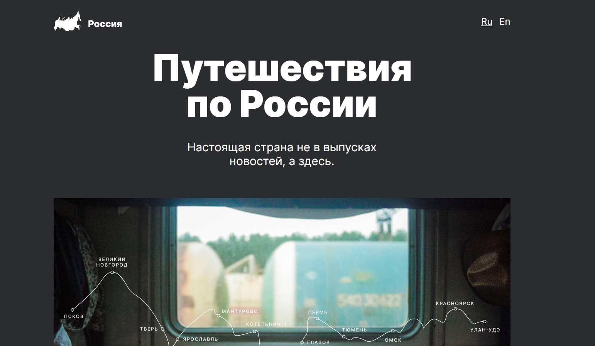

# sprint-4

Яндекс.Практикум Проектная работа по адаптивной верстке)

Доступна по ссылке [на GitHub Pages](https://anton-zm.github.io/sprint-4/)

## Описание

Одностраничный сайт о путешествии по России. Адаптивная вёрстка по макету Figma.

## Стек

HTML5, CSS3(grid, flexbox), BEM
